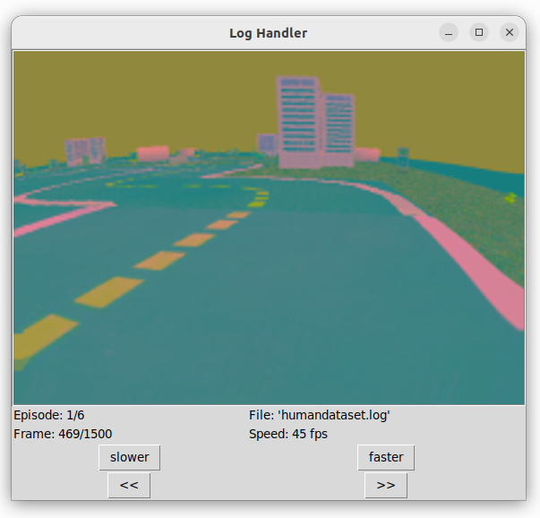
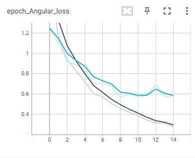
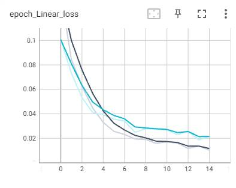
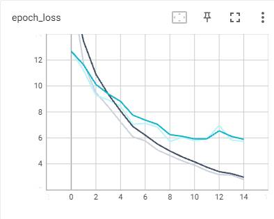
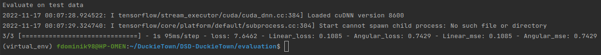

# Team: DSD (DuckieTown project)
Repository for autonomous driving in DuckieTown environment developed by the DSD team.

Team members:
- Ódor Dávid - IFZYRQ
- Weyde Szabolcs - DC6KRO
- Frey Dominik - AXHBUS

The goal of this project is to train and test a self-driving AI vehicle in the Duckie Town World simulation. During our work, we are planning to use a TensorFlow based imitation learning algorithm. We are starting out from the base project [Behavior Cloning](https://github.com/duckietown/challenge-aido_LF-baseline-behavior-cloning) which contains utilities for data generation, data visualisation, model training and model testing. Apart from that we will use various open source Duckie Town repositories which will be mentioned as we advance. Certain components of these projects will be integrated into our own solution as we modified and expanded them with new ideas and solutions to reach better results.

## Project tree

~~~
.
+-- dataGeneration
|   +-- human.py - Manual data generation by driving in simulator 
|   +-- automatic.py - Automatic data generation using pure pursuit
|   +-- log_schema.py - Dataset schema model
|   +-- log_util.py - Tool for structuring dataset entry
+-- dataVisualization
|   +-- log_combiner.py - Tool for appending datasets
|   +-- log_viewer.py - Tool for visualizing dataset
|   +-- log_schema.py - Dataset schema model
+-- training
|   +-- log_reader.py - Tool for reading dataset files
|   +-- my_model.py - Our neural network models
|   +-- log_schema.py - Dataset schema model
|   +-- train.py - Script for training the model
|   +-- trainedModel
    |   +-- MyModelBest_Loss.h5 - Training output, best by training loss
    |   +-- MyModelBest_Validation.h5 - Training output, best by validation loss
|   +-- trainlogs - training results
    |   +-- ....
+-- evaluation
|   +-- eval.py - Script for evaluating a model on test dataset
+-- map
|   +-- generator.py - Script for map generation
|   +-- MyMap.yaml - Our map for training
|   +-- MyMap_test.yaml - Our map for testing

~~~

## Installing the project

You can install all dependencies except for cuda tools using the following commands on linux machine:

~~~
git clone https://github.com/fdominik98/DSD-DuckieTown.git
cd DSD-DuckieTown
pip3 install -e .
pip3 install -r requirements.txt
~~~

## Using the project

### Training

For training a model these steps shall be done:
 1. Copy the training dataset to DSD-DuckieTown/training
 2. run the following command:
 ~~~
 python3 train.py --log_file {name_of_the_training_dataset_file_with_extension} --model_name {model name}
 ~~~
 The model can be MyModel for the pure convolutional model and MyModelLSTM for the LSTM model. 
 3. Check the train results running this command:

~~~
tensorboard --logdir trainlogs
~~~
 
 ### Evaluating
 1. Copy the test dataset to DSD-DuckieTown/evaluation
 2. Copy the trained .h5 model to DSD-DuckieTown/evaluation
 3. run the following command:
 ~~~
 python3 eval.py --log_file {name_of_the_test_dataset_file_with_extension} --model_path {name_of_the_trained_model_with_extension}
 ~~~
 

## Milestone 1: Preparing data

To collect a proper amount of data for training our model we are using the Duckie Town Simulator available at [Gym Duckie Town](https://github.com/duckietown/gym-duckietown). We are generating data while driving the vehicle in the simulator, capturing images assigned with the appropriate action (linear and angular velocity).

### Map generating

In order to run the simulator we needed a map to load into it. Although there are several preconstructed maps in the [Duckie Town World](https://github.com/duckietown/duckietown-world) repository we were advised to prepare our own. For this we used a map generator available at the [map-utils](https://github.com/duckietown/map-utils) repository. With this utility several configurations are supported e.g. map size, density of road object or side object.
Our map is generated using the [generator.py](https://github.com/fdominik98/DSD-DuckieTown/blob/main/map/generator.py) script with the following main configurations:
 - Map width = 11
 - Map height = 11
 - Map density = dense
 - Road objects = sparse
 - Side object = dense
 
 The output and the map we used to collect data from simulator: [MyMap.yaml](https://github.com/fdominik98/DSD-DuckieTown/blob/main/map/MyMap.yaml)
 
 The original script was modified by us to match the new format expectations of the simulator.
 
 ### Collecting training data
 
The next step was to use our map in a simulator with a script that captures information while driving the car. The script we used, [human.py](https://github.com/fdominik98/DSD-DuckieTown/blob/main/dataGeneration/human.py) is originated at the [Behavior Cloning](https://github.com/duckietown/challenge-aido_LF-baseline-behavior-cloning) repository. It allows the user to controll the vehicle with an xbox controller and to decide which generated log is to be saved to the dataset after the session is finished.
We used the script with the following main configurations:
- Map name: [MyMap](https://github.com/fdominik98/DSD-DuckieTown/blob/main/map/MyMap.yaml)
- Domain randomization: true (uses the simulators built in domain randomizator)
- Log file: [dataset.log](https://drive.google.com/drive/folders/1HAE6eQeRWJcNAe7YSUJVAuf9-UTMRLAq?usp=sharing) (the output)

We used an XBOX ONE controller for the driving and modified a base code to personalize the controlling.

After driving and generating for half an hour (keeping only the quality data), we managed to create a dataset of 500 MB which we will expand further when needed. [dataset.log](https://drive.google.com/drive/folders/1HAE6eQeRWJcNAe7YSUJVAuf9-UTMRLAq?usp=sharing)

### File format and visualization

Briefly the log file contains a list of frames and actions. For each frame there is an action to take which is repsresented in linear and angular velocity. The size of each image is **150x200** pixels and the linear and angular velocities come in lists of floats with two element. The first version of our dataset now consists of 6074 list items.

For visualizing our data we used a tool, [log_viewer.py](https://github.com/fdominik98/DSD-DuckieTown/blob/main/dataVisualization/log_viewer.py) originated from [Behavior Cloning](https://github.com/duckietown/challenge-aido_LF-baseline-behavior-cloning). With this utility we can see the recorded frames in order (as a video):  

There are also a 1-minute recording of the captured log at [dataset](https://drive.google.com/drive/folders/1HAE6eQeRWJcNAe7YSUJVAuf9-UTMRLAq?usp=sharing) by the name of **logcapture.webm**

We modified the original **log_viewer**.py so that it shows the linear and angular velocities for each frame.

### Creating train, test and validation sets

In code, the dataset can be read by the [log_reader.py](https://github.com/fdominik98/DSD-DuckieTown/tree/main/training/log_reader.py) module also taken from [Behavior Cloning](https://github.com/duckietown/challenge-aido_LF-baseline-behavior-cloning). The output of its **modern_read()** function is a tuple {frames, linear velocities, angular velocities}. These lists can be easily split into train, test and validation subsets by using **sklearn.model_selection** modules **train_test_split()** method.

## Milestone 2: Training the model

### Training on train set

#### The training
During training, we used the data we have already created during working on the first milestone. Since we have chosen behavior cloning as our aproach, the error of the model is highly dependent of the behavior we are trying to clone. We are using a Convolutional Neural Network right now, which seems to be promising, but we have already considered trying out other approaches like Recurrent Neural Networks or Variational Auto-encoders. It is not clear to us yet, which model will be the best for the scope of the project this semester though. The aspects we are planning to consider during further evaluations of these models are contains the accuracy, the prediction time, and the learning time. Two of us has successfully set up their environments to use GPUs for training the models, in order to speed up the workflow.

For the training, the [script (train.py)](https://github.com/fdominik98/DSD-DuckieTown/tree/main/training/train.py)
and the [model (my_model.py)](https://github.com/fdominik98/DSD-DuckieTown/tree/main/training/my_model.py)
we used is originated at the [Behavior Cloning](https://github.com/duckietown/challenge-aido_LF-baseline-behavior-cloning) repository.
We modified these two to match our desires.

The *train.py* can be used the following way:
 - Copy the dataset into the training directory.
 - Run *python train.py*

Or
 - specify the --log_file {path to dataset} options while executing *python train.py*

#### Training results

In the graphs below dark blue is the train dataset and light blue is the validation dataset. The faint lines are the original graphs and the not faint lines are the smoothed lines made by TensorBoard Smoothing with value 0,4.
First, in all images we can see that validation loss is bigger than train loss than a few epochs later the other way around, also we used mse (mean squared error) function in the model.

##### Angular loss

 We can see that the loss is decreasing continously in the train dataset, but there is a little hill in the validation dataset. Also angular loss is bigger than linear loss
##### Linear loss

 Linear loss values are pretty little which is good, we can see when we reach epoch 14, the loss is < 0.02
##### Epoch loss

With this model we could achieve this result, but we hope we can do better.
### Preparing test set

#### Generating new map
For testing the trained model we decided to generate a new dataset from a completely different 
map setup.

The new map is also generated using the [generator.py](https://github.com/fdominik98/DSD-DuckieTown/blob/main/map/generator.py) script with the following main configurations identical to the first maps configurations:
 - Map width = 11
 - Map height = 11
 - Map density = dense
 - Road objects = sparse
 - Side object = dense

The resulting [test map](https://github.com/fdominik98/DSD-DuckieTown/blob/main/map/MyMap_test.yaml) is available in the repository next to the [original](https://github.com/fdominik98/DSD-DuckieTown/blob/main/map/MyMap.yaml).

#### Generating test set from map

The next step was to use a script that generates our test_dataset. The script we used, [automatic.py](https://github.com/fdominik98/DSD-DuckieTown/blob/main/dataGeneration/automatic.py) is originated at the [Behavior Cloning](https://github.com/duckietown/challenge-aido_LF-baseline-behavior-cloning) repository.
The script automatically generates a dataset on the specified map with pure pursuit algorithm. As an extra, we modified the file to only save observation where the reward value ([0-1]) is greater than 0.6.
We used the script with the following main configurations:
- Map name: [MyMap_test](https://github.com/fdominik98/DSD-DuckieTown/blob/main/map/MyMap_test.yaml)
- Domain randomization: true (uses the simulators built in domain randomizator)
- Number of episodes: 10
- Log file: [test_dataset.log](https://drive.google.com/drive/folders/1HAE6eQeRWJcNAe7YSUJVAuf9-UTMRLAq?usp=sharing) (the output)

This way the script generated a test dataset of 30 MB. 

### Evaluating the model

For evaluation, we wrote a script which executes the test dataset on our [best validation model](https://github.com/fdominik98/DSD-DuckieTown/blob/main/trainedModel/MyModelBest_Validation.h5).
This script [eval.py](https://github.com/fdominik98/DSD-DuckieTown/blob/main/evaluation/eval.py) is located at the evaluation directory and can be used the following way:
 - Copy the test dataset and the .h5 model file into the evaluation directory.
 - Run *python eval.py*

Or
 - specify the --log_file {path to dataset} and
 - specify the --model_path {path to model} options while executing *python eval.py*
#### Our evaluation result
 
In the figure above it can be seen that after executing the script on the test dataset using mean square error function the results are:
- Linear loss: 0.1085
- Angular loss: 0.7429
- Loss: 7.6462

With this first stage model the linear and angular losses one by one are not too bad, but the all in all loss is something to be improved in the next stage.
