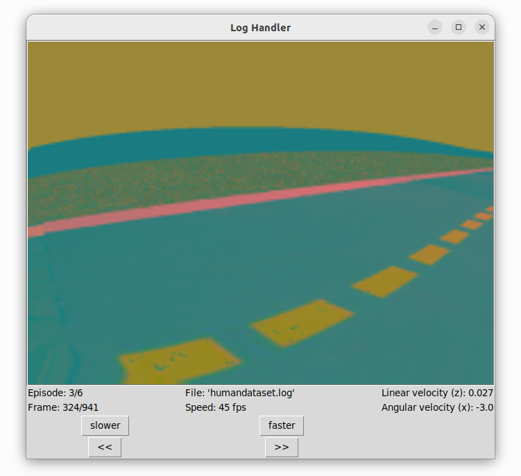

# Team: DSD
Repository for autonomous driving in DuckieTown environment developed by the DSD team.

Team members:
- Ódor Dávid - IFZYRQ
- Weyde Szabolcs - DC6KRO
- Frey Dominik - AXHBUS

The goal of this project is to train and test a self driving AI vehicle in the Duckie Town World simulation. During our work, we are planning to use a TensorFlow based imitation learning algorithm. We are starting out from the base project [Behavior Cloning](https://github.com/duckietown/challenge-aido_LF-baseline-behavior-cloning) which contains utilities for data generation, data visualisation, model training and model testing. Apart from that we will use various open source Duckie Town repositories which will be mentioned as we advance. Certain components of these projects will be integrated into our own solution as we modified and expanded them with new ideas and solutions to reach better results.

## Milestone 1: Collecting data

To collect a proper amount of data for training our model we are using the Duckie Town Simulator available at [Gym Duckie Town](https://github.com/duckietown/gym-duckietown). We are generating data while driving the vehicle in the simulator, capturing images assigned with the appropriate action (linear and angular velocity).

### Map generating

In order to run the simulator we needed a map to load into it. Although there are several preconstructed maps in the [Duckie Town World](https://github.com/duckietown/duckietown-world) repository we were advised to prepair our own. For this we used a map generator available at the [map-utils](https://github.com/duckietown/map-utils) repository. With this utility several configurations are supported e.g. map size, density of road object or side object.
Our map is generated using the [generator.py](https://github.com/fdominik98/DSD-DuckieTown/blob/milestone_1/map/generator.py) script with the following main configurations:
 - Map width = 11
 - Map height = 11
 - Map density = dense
 - Road objects = sparse
 - Side object = dense
 
 The output and the map we used to collect data from simulator: [MyMap.yaml](https://github.com/fdominik98/DSD-DuckieTown/blob/milestone_1/map/MyMap.yaml)
 
 The original script was modified by us to match the new format expectations of the simulator.
 
 ### Collecting training data
 
 The next step was to use our map in a simulator with a script that captures information while driving the car. The script we used, [human.py](https://github.com/fdominik98/DSD-DuckieTown/blob/milestone_1/dataGeneration/human.py) is originated at the [Behavior Cloning](https://github.com/duckietown/challenge-aido_LF-baseline-behavior-cloning) repository. It allows the user to controll the vehicle with an xbox controller and to decide which generated log is to be saved to the dataset after the session is finished.
We used the script with the following main configurations:
- Map name: [MyMap](https://github.com/fdominik98/DSD-DuckieTown/blob/milestone_1/map/MyMap.yaml)
- Domain randomization: true (uses the simulators built in domain randomizator)
- Log file: [dataset.log](https://drive.google.com/drive/folders/1HAE6eQeRWJcNAe7YSUJVAuf9-UTMRLAq?usp=sharing) (the output)

We used an XBOX ONE controller for the driving and modified a base code to personalize the controlling.

After driving and generating for half an hour (keeping only the quality data), we managed to create a dataset of 500 MB which we will expand further when needed. [dataset.log](https://drive.google.com/drive/folders/1HAE6eQeRWJcNAe7YSUJVAuf9-UTMRLAq?usp=sharing)

### File format and visualization

Briefly the log file contains a list of frames and actions. For each frame there is an action to take which is repsresented in linear and angular velocity. The size of each image is **150x200** pixels and the linear and angular velocities come in lists of floats with two element. The first version of our dataset now consists of 6074 list items.

For visualizing our data we used a tool, [log_viewer.py](https://github.com/fdominik98/DSD-DuckieTown/blob/milestone_1/dataVisualization/log_viewer.py) originated from [Behavior Cloning](https://github.com/duckietown/challenge-aido_LF-baseline-behavior-cloning). With this utility we can see the recorded frames in order (as a video):  

There are also a 1 minute recording of the captured log at [dataset](https://drive.google.com/drive/folders/1HAE6eQeRWJcNAe7YSUJVAuf9-UTMRLAq?usp=sharing) by the name of **logcapture.webm**

We modified the original **log_viewer**.py so that it shows the linear and angular velocities for each frame.
